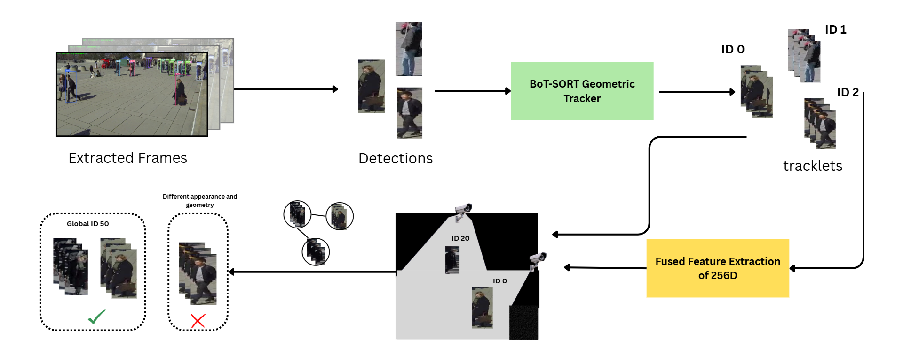
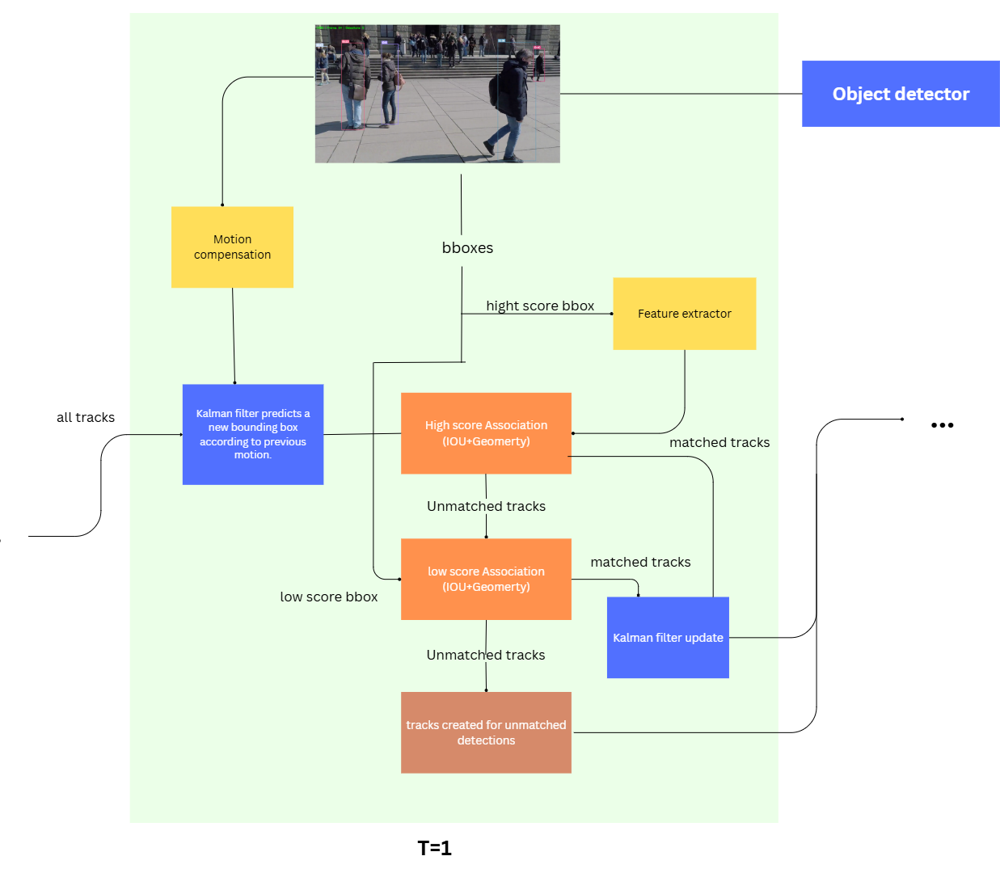
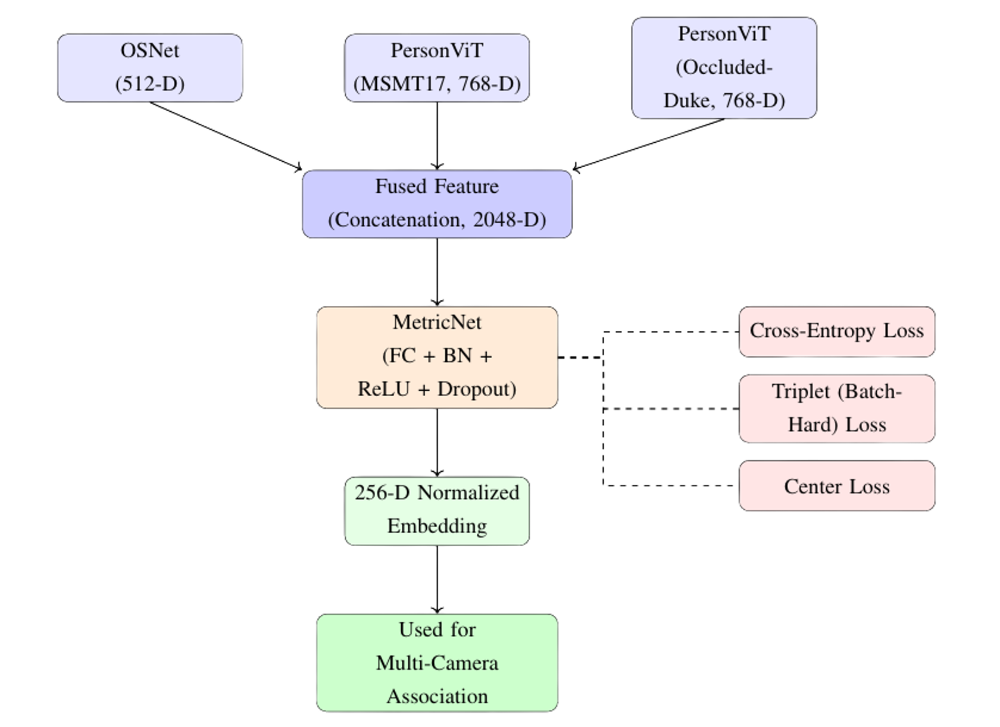
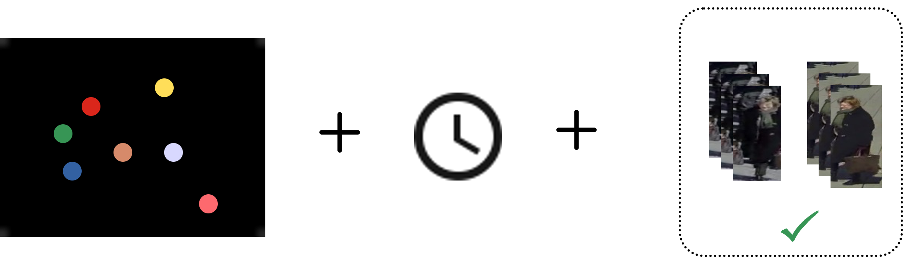
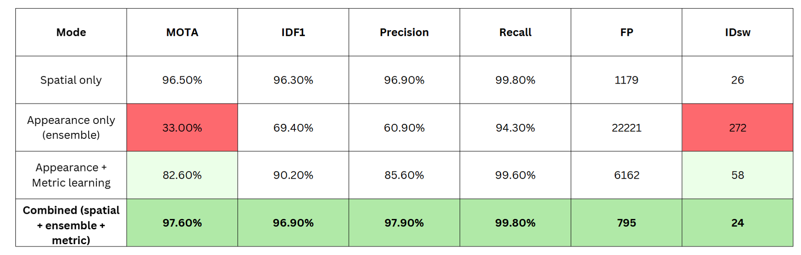

# Multi-Camera Multi-Object Tracking (MTMCT) System

## 🚀 Overview
This project presents a modular **Multi-Camera Multi-Object Tracking (MTMCT)** system designed to track individuals consistently across multiple surveillance cameras in crowded environments.

The system combines **geometry, appearance features, and temporal reasoning** to construct a single continuous trajectory for each person across all camera views.

---

## 🧱 System Pipeline



---

## 🧠 Problem
Tracking individuals across multiple cameras is challenging due to:

- Heavy **occlusions** in crowded scenes  
- **Similar appearances** between people  
- **Lighting and viewpoint variations** across cameras  
- Loss of identity when moving between camera views  

The goal is to assign **one global identity per person** across all cameras and reconstruct their full trajectory.

---

## 💡 Key Contributions

- **Geometry-Enhanced Tracking**  
  Extended BoT-SORT with **ground-plane projection** using camera calibration to reduce ID switches.

- **Multi-Model Re-Identification (Re-ID)**  
  Combined features from:
  - 2 × PersonViT (Transformer-based)
  - 1 × OSNet (CNN-based)

- **Feature Fusion + Metric Learning**  
  - Fused features into a **2048-D vector**
  - Learned a **256-D embedding space** for better similarity comparison

- **Hybrid Multi-Camera Association**  
  Matching based on:
  - Spatial (3D geometry)
  - Temporal consistency
  - Appearance similarity

---

## ⚙️ Method Highlights

### Geometry-Enhanced Tracking



- Project detections onto a **ground plane (3D space)**
- Combine:
  - 2D IoU (image space)
  - 3D distance (world space)

✅ Result:  
- ~79% reduction in ID switches  
- IDF1 improved to ~98.1% (single-camera tracking)

---

### Feature Fusion & Metric Learning



- Extract features from 3 models per track
- Average features per track → fuse into one vector
- Train embedding using:
  - Triplet Loss  
  - Cross-Entropy Loss  
  - Contrastive Learning  

✅ Result:
- Improved **Rank-1 accuracy and mAP**
- More robust similarity using cosine distance

---

### Multi-Camera Association



Two-stage matching:

**Stage 1: High-confidence matching**
- Threshold-based greedy assignment

**Stage 2: Hungarian optimization**
- Resolves ambiguous matches

Matching criteria:
- Temporal overlap  
- Spatial proximity (≤ 100 cm on ground plane)  
- Appearance similarity  

---

## 📊 Results



| Metric | Score |
|------|------|
| **MOTA** | **97.5%** |
| **IDF1** | **96.9%** |
| **ID Switch Reduction** | ~79% |
| **Rank-1 Accuracy** | 72.04% |
| **mAP** | 66.21% |

### Key Insights
- Geometry alone provides strong performance in overlapping views  
- Appearance-only matching is unreliable without metric learning  
- Feature fusion significantly improves discriminability  
- Combining geometry + appearance yields best results  

---

## 📈 Visualization

.gif)

---

## 📍 Dataset

- **WILDTRACK Dataset**
  - 7 synchronized and calibrated cameras  
  - Crowded scenes with overlapping views  
  - Realistic benchmark for multi-camera tracking  

### Preprocessing
- Original annotations: **2 FPS (every 5th frame)**
- Applied **linear interpolation** to improve tracking continuity

---

## 📄 Full Report
👉 `report/MTMCT_Thesis_report.pdf`

---

## ⚠️ Limitations

- Requires accurate **camera calibration**  
- Depends on **camera synchronization**  
- Evaluated only on WILDTRACK dataset  
- Performs best with **overlapping camera views**  
- Currently **offline (not real-time)**  

---

## 🔮 Future Work

- Real-time deployment on live camera streams  
- Automatic / learning-based camera calibration  
- Improved tracking in **non-overlapping camera setups**  
- Scalability to large-scale surveillance systems  

---

## 📌 Note

```
The source code is not publicly available due to project constraints.
This repository focuses on methodology, system design, and results.
```

---

## 🙏 Acknowledgment
This work was conducted as part of a Master’s thesis in Advanced Artificial Intelligence and Generative Systems.
